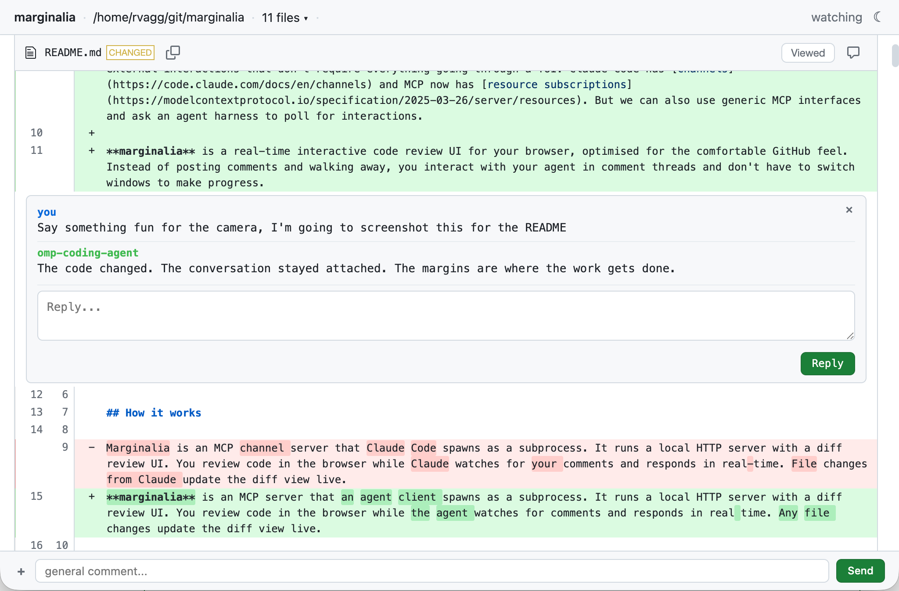

# marginalia

[](https://nodei.co/npm/@rvagg/marginalia/)

## Why

IDEs are, to some degree, _dead_ in the age of AI. But a TUI between you and the code you're responsible for is also unsatisfactory. What you really care about is the changes being made, and we have a process for that already: code reviews, and the GitHub pull request review interface is the version that most of us are used to.

So how do you bring that comfortable workflow to your agent interactions? [ghreview](https://github.com/rvagg/ghreview) was one attempt, but GitHub's round trip makes it too slow. Thankfully, agent harnesses are growing affordances for external interactions that don't require everything going through a TUI. Claude Code has [channels](https://code.claude.com/docs/en/channels) and MCP now has [resource subscriptions](https://modelcontextprotocol.io/specification/2025-03-26/server/resources). But we can also use generic MCP interfaces and ask an agent harness to poll for interactions.

**marginalia** is a real-time interactive code review UI for your browser, optimised for the comfortable GitHub feel. Instead of posting comments and walking away, you interact with your agent in comment threads and don't have to switch windows to make progress.



## How it works

**marginalia** is an MCP server that an agent client spawns as a subprocess. It runs a local HTTP server with a diff review UI. You review code in the browser while the agent watches for comments and responds in real time. Any file changes update the diff view live.

```
Browser  <--WebSocket-->  MCP Server  <--stdio-->  Agent client
```

- Comments flow through Claude Channels, a subscribed MCP resource, or explicit polling
- Agent replies appear threaded under your comments
- Agent file edits update the diff view automatically
- Claude Code permission prompts can be approved or denied from the browser

## Setup

### Install

Install globally:

```bash
npm install -g @rvagg/marginalia
```

The examples below use the `marginalia` command. Harnesses that can launch packages directly may use `npx -y @rvagg/marginalia` instead.

### Claude Code

Add marginalia as an MCP server:

```bash
claude mcp add -s user -t stdio marginalia -- marginalia
```

Or without a global install:

```bash
claude mcp add -s user -t stdio marginalia -- npx -y @rvagg/marginalia
```

Use `-e MARGINALIA_PORT=3456 -e MARGINALIA_HOST=0.0.0.0` before the server name to customise the port or listen address.

Start Claude Code with channels enabled:

```bash
claude --dangerously-load-development-channels server:marginalia
```

For a reusable opt-in, add a named alias to your shell configuration:

```bash
alias claude-marginalia='claude --dangerously-load-development-channels server:marginalia'
```

### Oh My Pi

Add marginalia to `~/.omp/agent/mcp.json`:

```json
{
  "mcpServers": {
    "marginalia": {
      "command": "marginalia"
    }
  }
}
```

Enable **MCP Update Injection** under `/settings`, or run:

```bash
omp config set mcp.notifications true
```

With MCP Update Injection enabled, OMP subscribes to `marginalia://comments/pending` and wakes the agent when it changes.

### Codex

Codex can list and read MCP resources, but does not subscribe to them or inject resource updates into the model turn. Browser comments are queued and must be drained with the `poll_comments` tool or the `/api/pending-comments` HTTP endpoint. The review UI, live diff updates, and MCP tools still work.

Add marginalia to `~/.codex/config.toml`:

```toml
[mcp_servers.marginalia]
command = "marginalia"

[mcp_servers.marginalia.env]
MARGINALIA_HOST = "0.0.0.0"
MARGINALIA_PORT = "3456"
```

Or, from a local checkout:

```toml
[mcp_servers.marginalia]
command = "node"
args = ["/path/to/marginalia/dist/server.js"]

[mcp_servers.marginalia.env]
MARGINALIA_HOST = "0.0.0.0"
MARGINALIA_PORT = "3456"
```

In Codex, ask:

> "start marginalia"

Codex calls the `start` tool and reports the URL. When using `MARGINALIA_HOST=0.0.0.0`, open `http://127.0.0.1:3456` locally; `0.0.0.0` is the listen address, not the browser address.

If Codex is sandboxing local commands, allow the MCP launch command so marginalia can bind its HTTP/WebSocket port. This rule goes in `~/.codex/rules/default.rules`, not `~/.codex/config.toml`. For the local checkout example above, add:

```rules
prefix_rule(pattern=["node", "/path/to/marginalia/dist/server.js"], decision="allow")
```

For a live review loop, you can ask Codex to make it work, e.g.:

> "For the next 30 minutes, poll marginalia for comments every 5 seconds and reply to each thread."

Codex repeatedly calls `poll_comments` while that turn remains active. Approve the polling and reply tools if prompted.

### Other MCP harnesses

Add marginalia as a stdio MCP server using the `marginalia` command, or `npx -y @rvagg/marginalia` without a global install.

Harnesses that support standard MCP resource subscriptions can receive live comments without a harness-specific extension. marginalia exposes `marginalia://comments/pending` and sends `notifications/resources/updated` when a browser comment arrives. A compatible harness subscribes to that resource, reads the pending comments, and responds through the `reply` tool.

Harnesses without resource subscriptions can use `poll_comments` to drain the same queue. If the harness supports recurring prompts or long-running turns, ask it to "poll marginalia" periodically and respond to each thread. This adds latency and model/tool usage, but provides a near-live fallback.

## Usage

By default, marginalia starts idle. Ask the agent to start it:

> "start marginalia on src/myproject/"

> "start marginalia on 0.0.0.0"

> "start marginalia"

The agent calls the `start` tool, picks a port, and gives you the URL. Only parameters you mention are set; everything else uses defaults.

## Environment variables

| Variable | Default | Description |
|---|---|---|
| `MARGINALIA_PORT` | `0` (random) | Default HTTP server port |
| `MARGINALIA_HOST` | `127.0.0.1` | Default listen address (use `0.0.0.0` for remote access) |
| `MARGINALIA_AUTO_START` | off | Set to `1` to start the server automatically on the session's working directory |

## Multiple sessions

Each Claude Code instance has its own marginalia server. With the default random port, there are no collisions. Ask "what's your marginalia URL?" and the agent will tell you.

To assign fixed ports, set `MARGINALIA_PORT`. If the port is in use, marginalia tries the next port (up to 10 attempts).

## Features

- GitHub-style diff rendering via diff2html with syntax highlighting
- Inline commenting on any diff line with threaded replies
- File-level comments anchored at the top of each file's diff
- General chat via the footer panel
- "Viewed" toggle to collapse reviewed files (auto-expands if the file changes)
- Copy file path button
- Ephemeral status messages ("Looking into this...") that get replaced by real replies
- Markdown rendering in comments and replies
- Permission relay for approving or denying Claude Code tool use from the browser
- Live comment delivery through Claude Channels or MCP resource subscriptions
- Live diff updates via 500ms polling

## License

Apache-2.0
